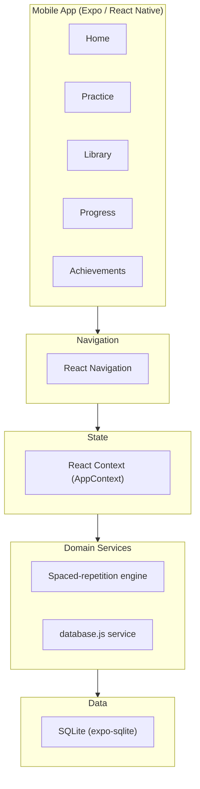
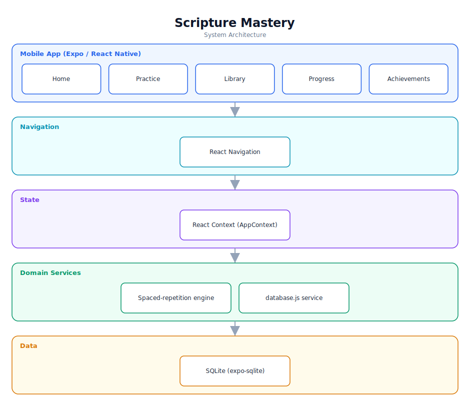

# Scripture Mastery — Software Documentation

> A gamified, Duolingo-style Bible memorization app with spaced repetition.

**Repository:** [`BibleMemorization`](https://github.com/Monametsi-s/BibleMemorization)  
**Type:** Cross-platform mobile application  
**Status:** Complete / functional

---

## 1. Overview

Scripture Mastery is a gamified Bible-memorization mobile app inspired by Duolingo. It uses a spaced-repetition algorithm to schedule reviews, multiple practice modes (fill-in-the-blank, multiple choice, typing), and a progression system with XP, levels, streaks, and achievements. Verses and progress are stored locally in SQLite, and global state is managed through React Context.

## 2. System Architecture

The diagram below shows the high-level architecture and how data flows between layers. It renders automatically on GitHub (Mermaid) and is also committed as a vector image ([`architecture.svg`](architecture.svg)).



<p align="center"></p>

### 2.1 Component responsibilities

| Layer | Responsibility |
|---|---|
| **Mobile app** | Screens for practice, library, progress, and achievements (React Native Paper). |
| **Navigation** | React Navigation stack/tab routing. |
| **State** | Global app state via React Context. |
| **Domain services** | Spaced-repetition scheduling and a database service layer. |
| **Data** | Local SQLite store for verses, mastery levels, and stats. |

## 3. Technology Stack

| Area | Technology |
|---|---|
| Framework | React Native + Expo |
| UI | React Native Paper |
| Navigation | React Navigation |
| Database | SQLite (expo-sqlite) |
| State | React Context API |
| Animation | React Native Reanimated |

## 4. Assumed User Requirements

_These requirements are inferred from the project's purpose and feature set; they document the intended behaviour rather than a formally agreed specification._

### 4.1 Functional requirements

- **FR-01** — Let users add verses to a personal library.
- **FR-02** — Schedule reviews using a spaced-repetition algorithm.
- **FR-03** — Offer fill-in-the-blank, multiple-choice, and typing practice modes.
- **FR-04** — Award XP, levels, streaks, and achievements.
- **FR-05** — Show progress analytics (accuracy, mastered verses, streaks).

### 4.2 Representative user stories

- As a learner, I want the app to remind me to review verses at the right time.
- As a learner, I want practice to feel like a game so I stay motivated.
- As a learner, I want to see how many verses I've mastered.

### 4.3 Non-functional requirements

- All data must persist locally and work offline.
- The spaced-repetition schedule must be deterministic and correct.
- Animations must remain smooth on mid-range devices.

## 5. Assumed System Requirements

### 5.1 End-user (runtime) requirements

- A physical Android or iOS device, or an emulator/simulator.
- The **Expo Go** app installed (for development builds) or an installed production build.
- Approximately 50–150 MB of free storage for the app and local data.

### 5.2 Server / hosting requirements

- None — this project runs entirely on the client; no application server is required.

### 5.3 External services & API keys

- None — the application has no third-party service dependencies at runtime.

### 5.4 Developer / build requirements

- Node.js 18+ and npm (or yarn/pnpm).
- Git for cloning the repository.
- A code editor such as VS Code (recommended).
- Expo CLI; an Android device or emulator for testing.

## 6. Data Model

SQLite tables for verses ({ id, reference, text, masteryLevel, nextReview }), practice history, and user stats (XP, level, streak). See the repo's DATABASE_SCHEMA.md for full details.

## 7. Setup & Installation

```bash
git clone https://github.com/Monametsi-s/BibleMemorization.git
cd BibleMemorization
npm install
npm start   # scan QR with Expo Go
```

## 8. Assumptions & Future Considerations

- Integrate a Bible API for one-tap verse import.
- Add speech recognition for audio recitation.
- Add social features (leaderboards, challenges) and dark mode.

---

<sub>This document was generated as part of a portfolio-wide documentation pass. User and system requirements are **assumed** from the codebase, README, and project intent, and should be validated against real product goals before being treated as authoritative.</sub>
